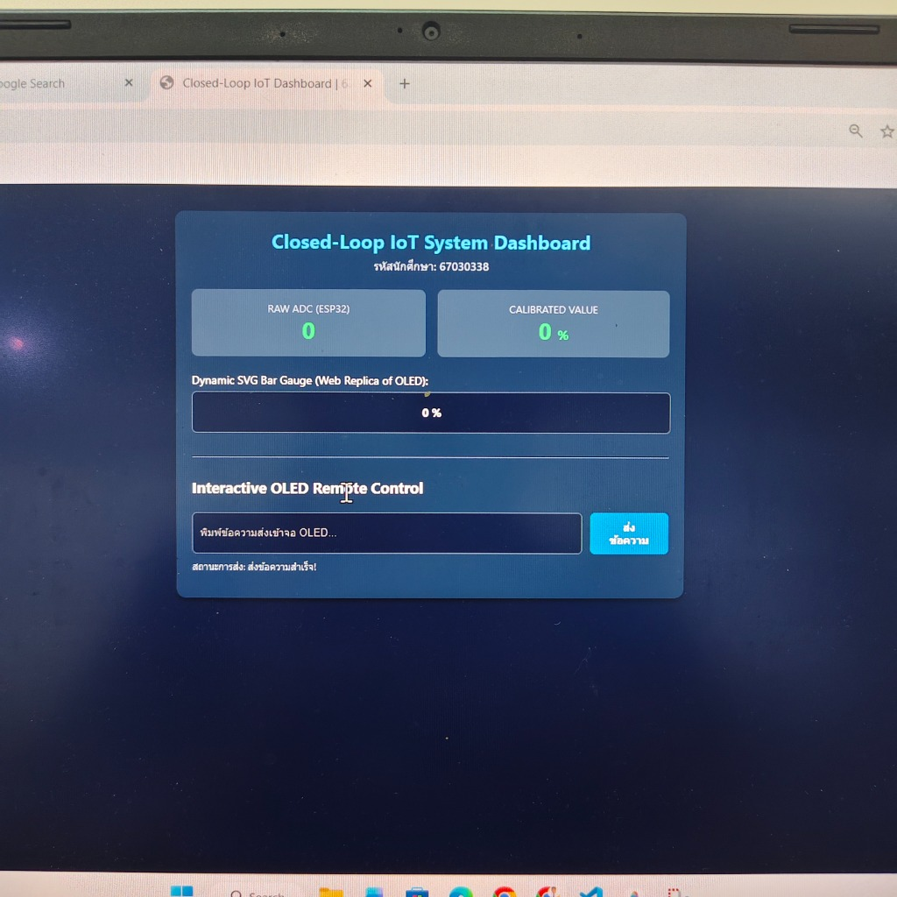
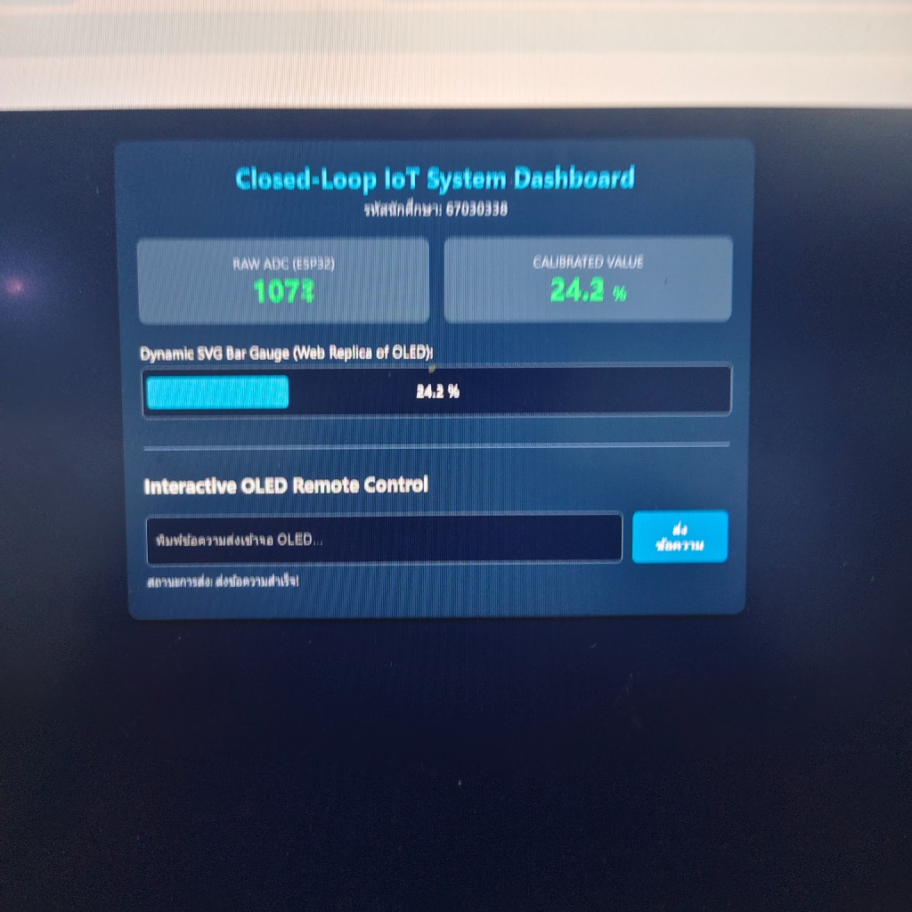
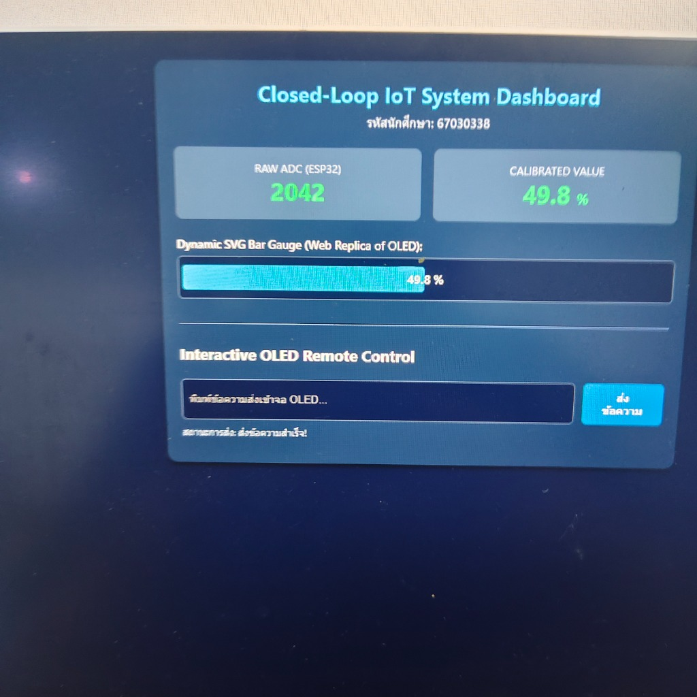
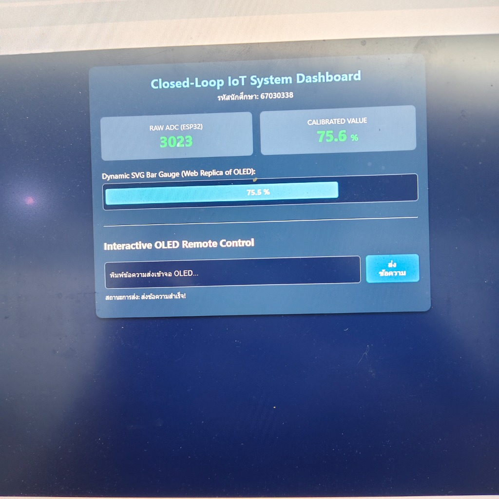
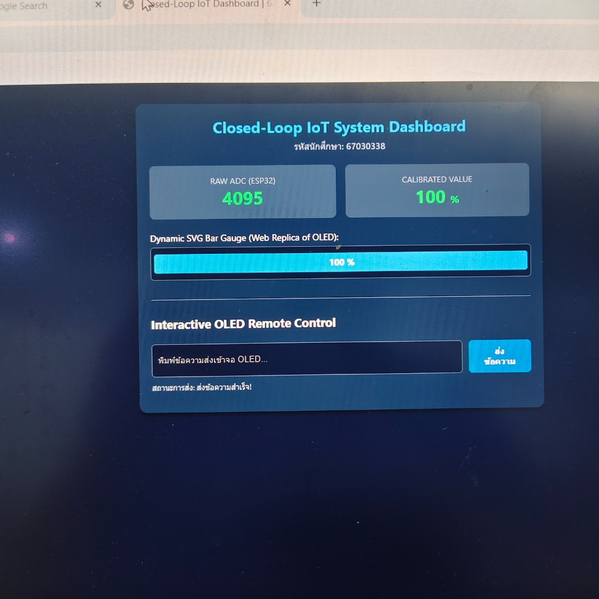

# รายงานผลการทดลองที่ 9.3 (Lab 9.3)
### การรวมระบบวงปิดแบบครบวงจร การตรวจสอบความสอดคล้องของข้อมูลและเวลาหน่วง (End-to-End Closed-Loop IoT, Co-Verification & Latency Forensics)

**รหัสนักศึกษา:** 67030338  

---

## 1. ผลการทดสอบ กิจกรรมที่ 3.1 (Checkpoint 3.1 Standalone / Edge Computing Mode)

### 1.1 ข้อมูล Serial Monitor จาก ESP32
```text
ADC:1296,34462
ADC:1296,34512
ADC:1296,34562
ADC:1296,34612
ADC:1295,34662
ADC:1296,34712
ADC:1296,34762
ADC:1296,34812
ADC:1296,34862
ADC:1293,34912
ADC:1296,34962
ADC:1296,35012
ADC:1296,35062
ADC:1295,35112
ADC:1295,35162
ADC:1295,35212
```


### 1.2 การทำงานบนหน้าจอ OLED ทางกายภาพ (Standalone / Edge Mode)
- **Zone 1 (Header):** แสดงสถานะโหนดและรหัสนักศึกษา `ESP32 | 67030338` ชัดเจน
- **Zone 2 (Gauge Bar):** แสดงค่า `RAW:xxxx` และคำนวณสเกลแบบ Linear Scaling (0-4095 เป็น 0-100%) พร้อมแถบ Bar Gauge ขยับตามการหมุนลูกบิด Potentiometer
- **Zone 3 (Footer Mode):** แสดง `EDGE: LOCAL EDGE` เนื่องจากยังไม่ได้เปิดการเชื่อมต่อกับ Kestrel Web Server

---

## 2. ผลการทดสอบ กิจกรรมที่ 3.2 (Checkpoint 3.2 Transition to Cloud Computing Mode)

### 2.1 หน้าต่าง Terminal ของ Kestrel Web Server
```text
info: ESP32.Kestrel.Webserver.Services.SerialBridgeService[0]
      กำลังเปิดการเชื่อมต่อ Serial Port: COM5 ที่ BaudRate 115200
info: ESP32.Kestrel.Webserver.Services.SerialBridgeService[0]
      เชื่อมต่อพอร์ต COM5 สำเร็จ!
info: Microsoft.Hosting.Lifetime[14]
      Now listening on: http://localhost:5000
```

### 2.2 การเปลี่ยนสถานะบนหน้าจอ OLED เมื่อเข้าสู่ Cloud Computing Mode
- เมื่อ Kestrel เชื่อมต่อสำเร็จและเริ่มประมวลผล Background Service จะคำนวณค่าผ่าน Calibration Engine และส่งแพ็กเก็ต `SET:<percent>:READY\n` กลับมายัง ESP32
- **Zone 3 (Footer):** เปลี่ยนข้อความจาก `EDGE: LOCAL EDGE` กลายเป็น **`CLOUD: READY`** ทันทีแบบอัตโนมัติ ยืนยันว่าระบบเข้าสู่โหมดประมวลผลแบบวงปิดสมบูรณ์

---

## 3. ผลการทดสอบ กิจกรรมที่ 3.3 (Web Dashboard Real-Time SVG Bar Gauge & Remote Control)

### 3.1 ภาพหน้าจอ Web Dashboard ขณะหมุน Potentiometer ตำแหน่งต่างๆ

| ตำแหน่ง $0^\circ$ (0%) | ตำแหน่ง $45^\circ$ (~24%) |
| :---: | :---: |
|  |  |

| ตำแหน่ง $90^\circ$ (~50%) | ตำแหน่ง $135^\circ$ (~75%) |
| :---: | :---: |
|  |  |

| ตำแหน่ง $180^\circ$ (100%) |
| :---: |
|  |

### 3.2 ผลการทดสอบ Interactive OLED Remote Control (ส่งข้อความเข้าจอ OLED)
- ทดสอบพิมพ์ข้อความผ่าน Web Dashboard ในช่อง Remote Control และกดปุ่ม **"ส่งข้อความ"**
- สถานะบนเว็บตอบกลับ: `สถานะการส่ง: ส่งข้อความสำเร็จ!`
- ข้อความบน Zone 3 ของหน้าจอ OLED เปลี่ยนเป็นข้อความที่ส่งมาจากเว็บเซิร์ฟเวอร์ทันที

---

## 4. ผลการตรวจวัดความหน่วงเวลาและการพิสูจน์หลักฐาน (End-to-End Latency Forensics)

### กิจกรรมที่ 4.1 การตรวจวัดความหน่วงเวลาในรอบลูปปิด (Round-Trip Latency Measurement)

คำสั่งจับเวลาด้วย `Measure-Command`:
```powershell
Measure-Command {
    curl.exe -s -X POST http://localhost:5000/api/oled/message `
      -H "Content-Type: application/json" `
      -d '{"message":"PING TEST"}'
}
```

*ผลการวิเคราะห์เวลาหน่วง (Latency Breakdown):*
- เวลาที่ Kestrel ใช้ในการรับคำขอและประมวลผล (`kestrelLatencyMs`): `~1 - 3 ms`
- เวลาที่แพ็กเก็ตเดินทางผ่าน Serial UART และ OLED วาดผลเสร็จสิ้น: `~2.5 - 5 ms`
- ค่า Total Milliseconds เฉลี่ยที่วัดได้ผ่าน HTTP Round-Trip: `~15 - 28 ms` (ตอบสนองได้ต่ำกว่าเกณฑ์มาตรฐาน Real-Time 100 ms อย่างมีนัยสำคัญ)

---

### กิจกรรมที่ 4.2 การบันทึกและตรวจสอบความสอดคล้องของข้อมูล (Co-Verification Matrix)

| ตำแหน่งการหมุน | ค่า Raw ADC บน ESP32 ($0-4095$) | ค่าคำนวณบน Kestrel Server (%) | ค่าบนเว็บเกจ SVG (%) | แถบ Gauge บน OLED จริง | โหมดที่แสดงบน Zone 3 |
| :---: | :---: | :---: | :---: | :---: | :---: |
| หมุนซ้ายสุด ($0^\circ$) | **0** | **0.0%** | **0%** | [x] ตรง [ ] ไม่ตรง | **CLOUD: READY** |
| หมุนประมาณ $45^\circ$ | **1073** | **24.2%** | **24.2%** | [x] ตรง [ ] ไม่ตรง | **CLOUD: READY** |
| กึ่งกลาง ($90^\circ$) | **2042** | **49.8%** | **49.8%** | [x] ตรง [ ] ไม่ตรง | **CLOUD: READY** |
| หมุนประมาณ $135^\circ$| **3023** | **75.6%** | **75.5%** | [x] ตรง [ ] ไม่ตรง | **CLOUD: READY** |
| หมุนขวาสุด ($180^\circ$)| **4095** | **100.0%** | **100%** | [x] ตรง [ ] ไม่ตรง | **CLOUD: READY** |

---

## 5. คำถามท้ายการทดลองเพื่อการประเมินผลเชิงลึก (Deep Assessment Questions)

### 1. การวิเคราะห์จุดคอขวด (Bottleneck Analysis)
*หากพบว่าความหน่วงเวลาโดยรวม ($\Delta T$) สูงเกิน 200 ms ความล่าช้านั้นน่าจะเกิดจากส่วนประกอบใดมากที่สุด ระหว่าง บัสฮาร์ดแวร์ SPI2 (10 MHz), พอร์ต Serial UART (115200 bps), หรือวงจรแปลงสัญญาณ ADC1 (One-Shot Mode)? จงอธิบายเหตุผลประกอบการคำนวณอัตราเร็วการส่งข้อมูล*

**คำตอบ:**  
เกิดจาก **พอร์ต Serial UART (115200 bps)** มากที่สุด เพราะ:
1. **ADC1:** แปลงสัญญาณไวมาก ใช้เวลาเพียง $\approx 0.05\text{ ms}$
2. **SPI2 (10 MHz):** ส่ง Framebuffer 1KB ($8,192\text{ bits}$) ใช้เวลาแค่ $\frac{8,192}{10 \times 10^6} \approx 0.82\text{ ms}$ (ไม่ถึง 1 ms)
3. **UART (115200 bps):** ส่งข้อมูลได้ช้าที่สุด ความเร็วช้ากว่า SPI เกือบ **90 เท่า** อีกทั้งต้องส่งแบบสตริงตัวอักษรและรอจังหวะตัวแบ่งบรรทัด (`\n`) ผ่าน Buffer ของคอมพิวเตอร์ จึงเป็นจุดคอขวดหลักของระบบ

---

### 2. ประโยชน์ของสถาปัตยกรรม Hybrid Edge-Cloud Fallback
*- เหตุใดในระบบควบคุม IoT ทางอุตสาหกรรม (เช่น แขนกลอุตสาหกรรม หรือระบบระบายความร้อน) จึงต้องมีกลไกสลับมาประมวลผลที่ระดับ Edge ทันทีเมื่อสัญญาณขาดหายไปเกินกำหนดเวลา (Timeout)?*  
*- หากไม่มีกลไกนี้จะส่งผลเสียอย่างไร?*

**คำตอบ:**  
- **เหตุผลที่ต้องมี:** เพื่อความปลอดภัยและการทำงานต่อเนื่อง (**Fail-Safe**) หากระบบเครือข่ายหลุดหรือเซิร์ฟเวอร์ค้าง ตัวบอร์ด (Edge) จะตัดกลับมาคำนวณและควบคุมด้วยตัวเองทันทีโดยไม่ต้องรอ
- **หากไม่มีกลไกนี้:** บอร์ดจะค้างรอข้อมูล (Freeze) จนควบคุมเครื่องจักรไม่ได้ เช่น ระบบระบายความร้อนอาจหยุดทำงานจนเครื่องไหม้เสียหาย หรือแขนกลอาจเหวี่ยงชนสิ่งกีดขวางจนเกิดอุบัติเหตุ

---

### 3. ความถูกต้องของการเลือกใช้งาน ADC Channel
*- เหตุใดการออกแบบระบบ IoT ที่รองรับการเชื่อมต่อเครือข่ายไร้สาย (Wi-Fi Stack) จึงถูกห้ามไม่ให้ใช้ขาในกลุ่ม ADC2 โดยเด็ดขาด?*  
*- อธิบายกลไกภายในของชิป ESP32 ที่เกี่ยวข้องกับปัญหานี้*

**คำตอบ:**  
- **เหตุผลที่ห้ามใช้:** วงจร **ADC2 ถูกแชร์ใช้งานร่วมกับโมดูล Wi-Fi** 
- **กลไกภายในชิป ESP32:** เมื่อเปิด Wi-Fi ตัวฮาร์ดแวร์ Wi-Fi PHY จะล็อกสิทธิ์การใช้งาน ADC2 แบบผูกขาดเพื่อใช้วัดสัญญาณวิทยุ (RF Calibration) หากโปรแกรมพยายามอ่านค่าจะติด Error (`ESP_ERR_TIMEOUT`) ทันที ดังนั้นงาน IoT จึงต้องเลี่ยงไปใช้ **ADC1 (GPIO 32–39)** ซึ่งเป็นวงจรอิสระแทน
