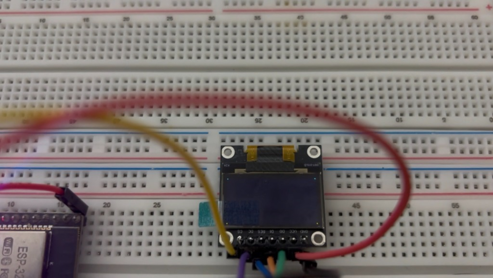
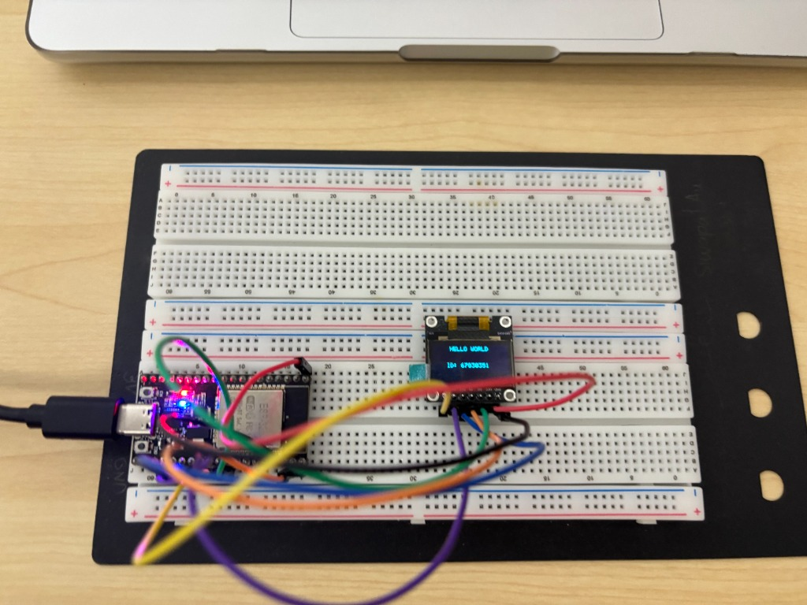

# ใบงานการทดลองที่ 9.1 (Lab 9.1)
> การประกอบสร้างตัวขับจอแสดงผล SSD1306 ทีละชิ้นส่วน (Deconstructed Bring-up) สู่ Hello World และการตรวจสอบความจำภาพเชิงนิติวิทยาศาสตร์ (Framebuffer Forensics)

## 3. บันทึกผลการทดลอง (Experimental Results)

### 3.1 ผลการทดสอบตามลำดับกิจกรรม

1. **กิจกรรมที่ 1.2 (Proof-of-Life Test):** เมื่อส่งชุดคำสั่งเปิด Charge Pump `0x8D, 0x14` และ Display ON `0xAF` พร้อมส่งข้อมูล `0xFF` ทั้งหมด 1,024 ไบต์ หน้าจอสว่างเต็มแผ่นทันที ยืนยันว่าบัส SPI และวงจรทวีแรงดัน 7.5V ทำงานสมบูรณ์
   

2. **กิจกรรมที่ 1.3 (Corner Pixels Test):** หลังล้างหน้าจอและสั่งจุดพิกเซลที่มุม `(0,0)`, `(127,0)`, `(0,63)`, `(127,63)` มีจุดสว่างขึ้น 4 จุดตรงมุมจอพอดี พิสูจน์ความถูกต้องของสูตรคำนวณบิตในแรม
   

3. **กิจกรรมที่ 1.4 (Text Display):** เมื่อเรียกฟังก์ชันแสดงผลข้อความ ปรากฏข้อความ `"HELLO WORLD"` และ `"ID: 67030351"` บนหน้าจอ OLED
   

### 3.2 ภารกิจสังเกตการณ์เชิงลึก (Forensic Visual Observation Challenge)
จากการสังเกตความผิดปกติทางกายภาพของแผงจอ OLED อย่างละเอียด พบปรากฏการณ์ดังนี้:
1. **แถบสีของจอภาพ (Dual-Color Zone):** โครงสร้างโมดูล 0.96" OLED ชนิด 2 สี มีแถบสีเหลือง (16 แถวบน) และแถบสีฟ้า (48 แถวล่าง) แต่บนจอจริงแถบสีเหลืองไปปรากฏอยู่ *ด้านล่าง*
2. **ทิศทางของตัวอักษร:** ข้อความ `"HELLO WORLD"` แสดงผลกลับหัว 180 องศา (Upside-down Display)


---

## 4. ขั้นตอนการตรวจสอบเชิงนิติวิทยาศาสตร์ (Framebuffer Forensics)

ในขั้นตอนนี้ นักศึกษาจะทำหน้าที่เป็น "นักนิติวิทยาศาสตร์คอมพิวเตอร์" เพื่อตรวจสอบความถูกต้องของข้อมูลในแรม (Memory Dump) เทียบกับพิกเซลที่ปรากฏบนจอจริง

### กิจกรรมนิติวิทยาศาสตร์ 1.1 Hex Dump Memory Inspection
เขียนคำสั่ง Dump ค่าใน `s_oled_buffer` บริเวณที่พิมพ์ตัวอักษรตัวแรก (เช่น ตัว `'H'`) ออกทาง Serial Monitor

```c
ESP_LOGI("FORENSIC", "=== DUMPING FRAMEBUFFER PAGE 0 (First 16 Bytes) ===");
for (int i = 0; i < 16; i++) {
    printf("Byte[%2d] (Col %2d): 0x%02X  [Binary: " BYTE_TO_BINARY_PATTERN "]\n", 
           i, i, s_oled_buffer[i], BYTE_TO_BINARY(s_oled_buffer[i]));
}
```

**ผลลัพธ์ที่ได้จาก Serial Monitor (UART Log):**
```text
SIC: === DUMPING FRAMEBUFFER PAGE 0 (First 16 Bytes) ===
Byte[ 0] (Col  0): 0x7F  [Binary: 01111111]
Byte[ 1] (Col  1): 0x08  [Binary: 00001000]
Byte[ 2] (Col  2): 0x08  [Binary: 00001000]
Byte[ 3] (Col  3): 0x08  [Binary: 00001000]
Byte[ 4] (Col  4): 0x7F  [Binary: 01111111]
Byte[ 5] (Col  5): 0x00  [Binary: 00000000]
Byte[ 6] (Col  6): 0x7F  [Binary: 01111111]
Byte[ 7] (Col  7): 0x49  [Binary: 01001001]
Byte[ 8] (Col  8): 0x49  [Binary: 01001001]
Byte[ 9] (Col  9): 0x49  [Binary: 01001001]
Byte[10] (Col 10): 0x41  [Binary: 01000001]
Byte[11] (Col 11): 0x00  [Binary: 00000000]
Byte[12] (Col 12): 0x7F  [Binary: 01111111]
Byte[13] (Col 13): 0x40  [Binary: 01000000]
Byte[14] (Col 14): 0x40  [Binary: 01000000]
Byte[15] (Col 15): 0x40  [Binary: 01000000]
```

---

### กิจกรรมนิติวิทยาศาสตร์ 1.2 Bit-to-Pixel Forensic Reconstruction
นำค่า Binary ของไบต์จาก Serial Monitor มาถอดรหัสบิตเป็นพิกเซลลงในตาราง:

#### 1. ตารางถอดรหัสบิตสำหรับตัวอักษรแรก `'H'` (Byte 0 – 4) และช่องไฟ (Byte 5)

| บิต / แถวพิกเซล (Y) | Byte[0]<br>(Col 0)<br>`0x7F` | Byte[1]<br>(Col 1)<br>`0x08` | Byte[2]<br>(Col 2)<br>`0x08` | Byte[3]<br>(Col 3)<br>`0x08` | Byte[4]<br>(Col 4)<br>`0x7F` | Byte[5]<br>(Col 5)<br>`0x00` (Spacing) |
| :---: | :---: | :---: | :---: | :---: | :---: | :---: |
| **Bit 0 (Row 0 / บนสุด)** | 1 | 0 | 0 | 0 | 1 | 0 |
| **Bit 1 (Row 1)** | 1 | 0 | 0 | 0 | 1 | 0 |
| **Bit 2 (Row 2)** | 1 | 0 | 0 | 0 | 1 | 0 |
| **Bit 3 (Row 3 / แกนกลาง)** | 1 | 1 | 1 | 1 | 1 | 0 |
| **Bit 4 (Row 4)** | 1 | 0 | 0 | 0 | 1 | 0 |
| **Bit 5 (Row 5)** | 1 | 0 | 0 | 0 | 1 | 0 |
| **Bit 6 (Row 6)** | 1 | 0 | 0 | 0 | 1 | 0 |
| **Bit 7 (Row 7 / ขอบล่าง)** | 0 | 0 | 0 | 0 | 0 | 0 |

#### 2. แผนภาพแสดงผลลัพธ์พิกเซลจำลอง (Pixel Visual Reconstruction: '1' = █, '0' = ·)

```text
Row 0 (Bit 0):  1 0 0 0 1   (Col 0-4 เป็นเส้นข้าง, คานว่าง)
Row 1 (Bit 1):  1 0 0 0 1
Row 2 (Bit 2):  1 0 0 0 1
Row 3 (Bit 3):  1 1 1 1 1   (บิต 3 เป็น 1 ทั้งหมด เกิดเป็นเส้นขวางคานกลางของตัว 'H')
Row 4 (Bit 4):  1 0 0 0 1
Row 5 (Bit 5):  1 0 0 0 1
Row 6 (Bit 6):  1 0 0 0 1
Row 7 (Bit 7):  0 0 0 0 0   (บิต 7 เป็น 0 สำหรับระยะเว้นบรรทัด / 8-pixel page spacing)
```

> **ข้อสังเกตเพิ่มเติมจาก Dump:**
> - **Byte 6 – 10 (`0x7F, 0x49, 0x49, 0x49, 0x41`):** คือตัวอักษร `'E'` (Bit 0, 3, 6 ติดตามขอบบน-กลาง-ล่าง และ Col 0 เป็นเส้นตั้งขอบซ้าย)
> - **Byte 11 (`0x00`):** คือช่องไฟ (Character Spacing)
> - **Byte 12 – 15 (`0x7F, 0x40, 0x40, 0x40...`):** คือตัวอักษร `'L'` (Col 0 เป็นเส้นตั้งยาว และ Bit 6 ติดตามขอบล่าง)
> สรุปได้ว่าข้อมูลใน Framebuffer ลำดับแรกคือคำว่า `"HEL..."` ของข้อความ `"HELLO WORLD"` อย่างถูกต้องสมบูรณ์

#### 3. การพิสูจน์เชิงนิติวิทยาศาสตร์ (Forensic Verdict)
รูปแบบของบิต `1` ใน Framebuffer ตรงกับรูปร่างของตัวอักษร `'H'` ตามฟอนต์ขนาด 5x7 พิกเซลอย่างแน่นอน โดย:
1. **คอลัมน์ซ้ายและขวา (Col 0 และ Col 4):** บิต 0 ถึง 6 มีค่าเป็น `1` (`0x7F` = `01111111b`) ทำหน้าที่เป็นเส้นแนวตั้งสองฝั่งของตัว 'H'
2. **คอลัมน์แกนกลาง (Col 1, 2, 3):** บิต 3 เท่านั้นที่มีค่าเป็น `1` (`0x08` = `00001000b`) ทำหน้าที่ลากเส้นเชื่อมคานแนวนอนระหว่างเสาสองต้น
3. **ช่องไฟ (Col 5):** มีค่าเป็น `0x00` เพื่อเว้นระยะ 1 พิกเซลระหว่างตัวอักษรไม่ให้ตัวอักษรติดกัน

---

## 5. คำถามท้ายการทดลองเพื่อการประเมินผล (Review Questions)

### 1. จากการทำ Hex Dump ในกิจกรรมนิติวิทยาศาสตร์ จงอธิบายว่าทำไมตัวอักษร `'H'` จึงใช้ข้อมูลจำนวน 5 ไบต์ และแต่ละไบต์ทำหน้าที่ควบคุมพิกเซลในทิศทางใด?
**ตอบ:**
- เนื่องจากตารางฟอนต์ที่ใช้คือ `font5x7` ซึ่งมีขนาดความกว้าง 5 คอลัมน์ (ความกว้าง 5 พิกเซล) x ความสูง 7 แถว (7 พิกเซล) 
- ประกอบกับโครงสร้างสถาปัตยกรรมหน่วยความจำของไดรเวอร์ SSD1306 ในโหมด Page Addressing จะจัดเรียงข้อมูลแบบ **1 ไบต์ ควบคุม 1 คอลัมน์ในแนวตั้ง (Vertical 8-bit slice)** โดยแต่ละบิต (Bit 0 – Bit 7) จะแทนตำแหน่งพิกเซลจากแถวบนลงล่าง ($Y$ ถึง $Y+7$) ภายใน Page นั้น
- ดังนั้น การวาดตัวอักษรที่มีความกว้าง 5 พิกเซล จึงต้องใช้ข้อมูลจำนวน **5 คอลัมน์ เรียงต่อกันในแนวนอน** ส่งผลให้ต้องใช้ข้อมูลทั้งหมด **5 ไบต์**
- **ทิศทางการควบคุม:**
  - **ภายในแต่ละไบต์ (Bit 0 ถึง Bit 7):** ควบคุมพิกเซลใน **"แนวตั้ง" (แกน Y)**
  - **ลำดับของทั้ง 5 ไบต์:** ทำหน้าที่ควบคุมการเดินหน้าพิกัดใน **"แนวนอน" (แกน X หรือ Col 0 ถึง Col 4)** เพื่อประกอบร่างขึ้นเป็นสัญลักษณ์ตัวอักษร

---

### 2. หากเราสลับสายไฟระหว่างขา **D0** และ **D1** จะเกิดผลอย่างไรกับสัญญาณ SPI และหน้าจอจะติดหรือไม่?
**ตอบ:**
- ตามการนิยาม Pinout ของโปรโตคอล SPI บนโมดูล SSD1306:
  - **D0** คือขา **SCK / SCLK (SPI Serial Clock)**
  - **D1** คือขา **MOSI / SDIN (Master Out Slave In / Serial Data)**
- หากสลับสายไฟระหว่างสองขานี้:
  - ขา Clock (D0) ของ SSD1306 จะได้รับสัญญาณสตรีมข้อมูลแทน ทำให้ไม่มี Clock Edge ที่เป็นจังหวะคงที่คอยกระตุ้นวงจร Shift Register ภายใน
  - ขา Data (D1) ของ SSD1306 จะได้รับสัญญาณ Clock แทน ซึ่งไม่สามารถถอดรหัสเป็น Byte Frame คำสั่งหรือข้อมูลที่ถูกต้องได้
  - ส่งผลให้ระบบบัส SPI ไม่สามารถ Sync สัญญาณและไม่สามารถส่งข้อมูลใด ๆ เข้าสู่ Command/Data Decoder ของ SSD1306 ได้สำเร็จ
- **ผลต่อหน้าจอ:** **หน้าจอจะไม่ติด (จอดำสนิท)** เนื่องจากไม่สามารถรับคำสั่งในขั้นตอน Magic Initialization Sequence ได้ โดยเฉพาะคำสั่ง `0x8D 0x14` (เปิดวงจรทวีแรงดัน Charge Pump 7.5V ภายในชิป) และคำสั่ง `0xAF` (Display ON) ทำให้แผงจอ OLED ขาดแรงดันไฟฟ้าสำหรับขับเปล่งแสงของไดโอด

---

### 3. เหตุใดการแก้ไขพิกัด $(x, y)$ บน `s_oled_buffer` จึงไม่ทำให้ภาพบนหน้าจอจริงเปลี่ยนทันที จนกว่าจะมีการเรียกคำสั่ง `oled_flush()`?
**ตอบ:**
- เพราะระบบใช้สถาปัตยกรรมการเรนเดอร์แบบ **Framebuffer (Double Buffering Architecture)**:
  - ตัวแปร `s_oled_buffer[1024]` เป็นหน่วยความจำที่จองอยู่ใน **Internal SRAM ของไมโครคอนโทรลเลอร์ (ESP32)** ทำหน้าที่เป็น "Back Buffer / Canvas" จำลอง
  - ส่วนแรมที่ใช้ควบคุมการเปล่งแสงของพิกเซลบนจอจริงคือ **GDDRAM (Graphic Display Data RAM)** ซึ่งฝังอยู่ภายในตัวชิป SSD1306 บนบอร์ดจอ
  - การเรียกใช้ฟังก์ชัน `oled_draw_pixel(x, y)` หรือฟังก์ชันวาดกราฟิกอื่น ๆ เป็นเพียงการคำนวณและปรับเปลี่ยนค่าบิต (Bitwise manipulation ด้วย OR / AND-NOT) บนหน่วยความจำแรมของ ESP32 เท่านั้น โดยที่ตัวไมโครคอนโทรลเลอร์ยังไม่ได้ส่งสัญญาณข้อมูลใด ๆ ผ่านบัสฮาร์ดแวร์ SPI
  - ภาพบนหน้าจอจะเปลี่ยนก็ต่อเมื่อมีการเรียกใช้คำสั่ง `oled_flush()` ซึ่งทำหน้าที่ส่งคำสั่งกำหนดกรอบพิกัด (`0x21` Set Column และ `0x22` Set Page) แล้วทำการส่งข้อมูลทั้งหมด 1,024 ไบต์ผ่านบัส SPI ยิงเข้าไปอัปเดตลง GDDRAM ของจอ SSD1306 โดยตรง
- **ประโยชน์ในมุมมองวิศวกรรมคอมพิวเตอร์:**
  1. **ลดภาระบัสสื่อสาร (Reduce SPI Bus Overhead):** การเปลี่ยนแปลงทีละพิกเซลไม่ต้องส่งข้อมูลผ่าน SPI ทุกครั้ง ซึ่งช้าและสิ้นเปลืองเวลา CPU
  2. **ป้องกันภาพกระพริบและการฉีกขาดของภาพ (Prevent Screen Flickering & Tearing):** ทำให้โปรแกรมสามารถวาดองค์ประกอบกราฟิกและข้อความให้เสร็จสมบูรณ์ในแรมก่อน จากนั้นค่อยดันข้อมูลขึ้นจอพร้อมกันในจังหวะเดียว (Atomic visual update)

---

# ใบงานการทดลองที่ 9.2 (Lab 9.2)
> การพัฒนาเอนจินปรับเทียบเซนเซอร์และ API ควบคุมการแสดงผลบน Kestrel Web Server พร้อมการพิสูจน์หลักฐานเครือข่าย (HTTP Payload Forensics)

## 4. ขั้นตอนการตรวจสอบเชิงนิติวิทยาศาสตร์ (HTTP Payload Forensics)

### กิจกรรมนิติวิทยาศาสตร์ 2.1 ทดสอบเรียกใช้งาน API ครบทั้ง 3 รูปแบบ

#### 1. ตรวจสอบ Telemetry ปัจจุบัน (HTTP GET)
```powershell
PS C:\Users\Petch_PC\Desktop\dev\Week-09-SPI-OLED-and-Kestrel-UI> curl.exe -i -X GET http://localhost:5017/api/telemetry
```
**Raw Response:**
```http
HTTP/1.1 200 OK
Content-Type: application/json; charset=utf-8
Date: Mon, 14 Sep 2026 14:34:24 GMT
Server: Kestrel
Transfer-Encoding: chunked

{"raw":2048,"calibrated":49.9,"unit":"%","displayMsg":"SYSTEM READY","timestamp":"2026-09-14T14:34:24.8387138Z"}
```

**ผลลัพธ์จากการเรียกด้วย `Invoke-RestMethod`:**
```powershell
PS C:\Users\Petch_PC\Desktop\dev\Week-09-SPI-OLED-and-Kestrel-UI> Invoke-RestMethod -Uri http://localhost:5017/api/telemetry -Method Get


raw        : 2048
calibrated : 49.9
unit       : %
displayMsg : SYSTEM READY
timestamp  : 2026-09-14T14:34:47.4575788Z
```

#### 2. ทำการ Calibrate เซนเซอร์ใหม่ (HTTP POST พร้อม JSON Body)
```powershell
PS C:\Users\Petch_PC\Desktop\dev\Week-09-SPI-OLED-and-Kestrel-UI> Invoke-RestMethod -Uri http://localhost:5017/api/potentiometer/calibrate -Method Post -ContentType "application/json" -Body '{"rawMin": 200, "rawMax": 3800, "scaleMin": 0, "scaleMax": 1000, "unit": "RPM"}'  

status  settings                                                       
------  --------                                                       
success @{rawMin=200; rawMax=3800; scaleMin=0; scaleMax=1000; unit=RPM}
```

#### 3. ส่งข้อความใหม่ไปแสดงบนหน้าจอ OLED (HTTP POST)
```powershell
PS C:\Users\Petch_PC\Desktop\dev\Week-09-SPI-OLED-and-Kestrel-UI> Invoke-RestMethod -Uri http://localhost:5017/api/oled/message -Method Post -ContentType "application/json" -Body '{"message":"Hello OLED"}'                                                                  

status  current   
------  -------   
success Hello OLED
```

---

## 5. คำถามท้ายการทดลองเพื่อการประเมินผล (Review Questions)

### 1. เหตุใดการคำนวณสเกลเซนเซอร์จึงควรทำที่ฝั่ง Kestrel Server แทนที่จะคำนวณบนไมโครคอนโทรลเลอร์ ESP32 ตั้งแต่แรก?
**ตอบ:**
- **สถาปัตยกรรม Edge vs Cloud/Core Separation:** ESP32 ควรทำหน้าที่เป็น Edge Device ที่เน้นความเร็วและใช้ทรัพยากรน้อยที่สุด โดยส่งเฉพาะค่าแอนะล็อกดิบ (Raw ADC 0-4095) ซึ่งเป็นข้อมูลสัจพจน์ (Ground Truth Data) ผ่านเครือข่าย
- **ความยืดหยุ่นในการจัดการ Calibration Model:** การคำนวณสเกล สโลป และสมการปรับเทียบ (Two-Point Linear Calibration) บน Kestrel Server ช่วยให้ผู้ดูแลระบบสามารถปรับเปลี่ยนพารามิเตอร์ Zero/Span Scale หรือเปลี่ยนหน่วยวัดได้จากศูนย์กลางผ่าน REST API โดย**ไม่ต้องแก้ไขหรือแฟลชเฟิร์มแวร์ใหม่ (No Firmware Re-flash)** ลงบนอุปกรณ์ ESP32
- **ประสิทธิภาพและการใช้พลังงาน:** Kestrel Server ทำงานบนคอมพิวเตอร์ที่มี FPU ประสิทธิภาพสูง การคำนวณคณิตศาสตร์ทศนิยมที่ฝั่งเซิร์ฟเวอร์ช่วยลดภาระ CPU และประหยัดพลังงานบนไมโครคอนโทรลเลอร์ ESP32

---

### 2. จากการทำ HTTP Forensics หากไม่มีการตรวจสอบเงื่อนไข `RawMax <= RawMin` ในโค้ด จะเกิด Exception ชนิดใดขึ้นในภาษา C# และส่งผลต่อการทำงานของเซิร์ฟเวอร์อย่างไร?
**ตอบ:**
- **ชนิด Exception:** หาก `RawMax == RawMin` ตัวหาร `(RawMax - RawMin)` ในสมการสเกลลาร์จะเป็น `0` ซึ่งหากเป็น Integer จะเกิด `System.DivideByZeroException` แต่หากเป็น `double` จะได้ผลลัพธ์เป็น `Infinity` หรือ `NaN` (Not a Number)
- **ผลกระทบต่อเซิร์ฟเวอร์:** หากไม่ได้ดักจับด้วย Exception handling หรือ Validation โค้ดจะทำให้ Kestrel ตอบกลับผู้ใช้ด้วยรหัสความผิดพลาด `HTTP 500 Internal Server Error` การเพิ่มเงื่อนไข `if (newSettings.RawMax <= newSettings.RawMin) throw new ArgumentException(...)` เพื่อดักจับและตอบกลับด้วย `HTTP 400 Bad Request` ช่วยป้องกันไม่ให้เซิร์ฟเวอร์ล่ม (No Server Crash)

---

### 3. อธิบายสาเหตุทางเทคนิคว่าทำไมคำขอ HTTP POST ที่ไม่มี Header `Content-Type: application/json` จึงถูกปฏิเสธด้วยรหัสสถานะ `415 Unsupported Media Type`?
**ตอบ:**
- **Content Negotiation & Model Binding:** ใน Kestrel Minimal API เมื่อ Route กำหนดรับพารามิเตอร์ Request Body เฟรมเวิร์ก .NET จะใช้ JSON Model Binder (`System.Text.Json`) เพื่อแปลง Body เป็น C# Object
- **บทบาทของ Header:** `Content-Type` เป็นข้อตกลงมาตรฐานของ HTTP/1.1 ที่แจ้งให้ Web Server ทราบชนิดข้อมูลของ Body Payload
- **สาเหตุ HTTP 415:** หากคำขอไม่ได้ระบุ `Content-Type: application/json` Kestrel จะไม่แน่ใจว่า Body สามารถ Deserialized เป็น JSON ได้อย่างปลอดภัยหรือไม่ เพื่อปฏิบัติตามมาตรฐาน RESTful และป้องกันช่องโหว่ความปลอดภัย Kestrel จึงปฏิเสธคำขอด้วยรหัส `415 Unsupported Media Type` ตั้งแต่ระดับ Middleware Layer