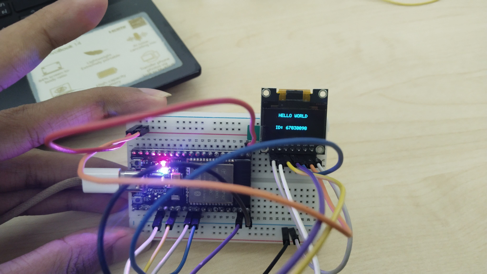

# คำตอบใบงานที่ 9.1
### ประกอบตัวขับจอ SSD1306 ทีละส่วน จนวาด Hello World ได้ + ตรวจสอบข้อมูลในแรม

| | |
| :--- | :--- |
| รหัสนักศึกษา | 67030098 |
| ใบงาน | [06-Labsheet-09-1-SPI-OLED-Deconstructed-Bringup.md](../06-Labsheet-09-1-SPI-OLED-Deconstructed-Bringup.md) |
| โค้ด | [`Code/Lab9-1_OLED_BringUp/`](../Code/Lab9-1_OLED_BringUp/) → [`main.c`](../Code/Lab9-1_OLED_BringUp/main/main.c) |
| อุปกรณ์ | ESP32 + จอ OLED SSD1306 0.96" (SPI 7 ขา) / ESP-IDF v6.x |
| รูปหลักฐาน | [Image/09-lab9-1-physical-hello-world.jpg](../Image/09-lab9-1-physical-hello-world.jpg) |

---

## การต่อวงจร

| ขา OLED | ต่อไปที่ ESP32 | หมายเหตุ |
| :---: | :---: | :--- |
| GND | GND | |
| VCC | 3.3V | ห้ามต่อ 5V |
| D0 (SCK) | GPIO 18 | |
| D1 (MOSI) | GPIO 23 | |
| RES | GPIO 4 | |
| DC | GPIO 2 | 0 = คำสั่ง, 1 = ข้อมูล |
| CS | GPIO 5 | ไดรเวอร์ SPI คุมให้เอง ไม่ต้องเขียนโค้ดสั่งเอง |

---

## สิ่งที่ทำในแต่ละกิจกรรม

### 1.1 ส่งคำสั่งและข้อมูลผ่าน SPI

หัวใจของจอนี้คือขา **DC** — ก่อนส่งอะไรออกไปต้องบอกชิปก่อนว่าสิ่งที่กำลังจะส่งเป็น "คำสั่ง" หรือ "ข้อมูลพิกเซล"

- `oled_send_cmd()` → ดึง DC ลง LOW ก่อนส่ง (คำสั่งตั้งค่าชิป)
- `oled_send_data()` → ดึง DC ขึ้น HIGH ก่อนส่ง (ข้อมูลพิกเซลที่จะไปเก็บในแรมจอ)

ตอนตั้งค่าบัส SPI มีจุดที่ต้องระวัง:
- `miso_io_num = -1` เพราะจอนี้รับข้อมูลอย่างเดียว ไม่มีขาส่งกลับ
- `max_transfer_sz` ต้องตั้งให้ใหญ่กว่า 1024 ไบต์ ไม่งั้นตอนส่ง Framebuffer ทั้งจอทีเดียวจะ error
- ใช้ Mode 0 ตามที่ SSD1306 กำหนด (CPOL=0, CPHA=0)

### 1.2 ปลุกจอให้ติด

ลำดับคำสั่งสำคัญที่สุดคือ `0x8D` ตามด้วย `0x14` — เป็นคำสั่งเปิดวงจรทวีแรงดันภายในชิป (Charge Pump) ยกจาก 3.3V เป็น 7.5V เพื่อจุดเม็ด OLED ถ้าลืมส่งคู่นี้ หรือส่ง `0x10` แทน `0x14` จอจะดับสนิทแม้จะสั่ง Display ON แล้วก็ตาม

พอรันโค้ดจริงจะเห็นจอสว่างขาวทั้งแผ่นทันที แปลว่า SPI สื่อสารได้ปกติ Charge Pump ทำงาน และพิกเซลทุกจุดยังดีอยู่

> จอที่ใช้เป็นแบบ 2 สี ครึ่งบนสีเหลือง ครึ่งล่างสีฟ้า อันนี้เป็นสารเรืองแสงที่เคลือบมาจากโรงงาน ซอฟต์แวร์สั่งเปลี่ยนไม่ได้

### 1.3 วาดพิกเซลลงแรม 1KB

สูตรแปลงพิกัด (x, y) เป็นตำแหน่งในแรม:

```
byte_index = x + (y / 8) * 128
bit_offset = y % 8
```

เหตุผลที่สูตรหน้าตาแบบนี้ เพราะแรมของจอ (GDDRAM) ไม่ได้เก็บแบบตาราง x,y ตรงๆ แต่แบ่งเป็น 8 "Page" โดย 1 ไบต์ = พิกเซลแนวตั้ง 8 จุดในคอลัมน์เดียวกัน ดังนั้น `y/8` บอกว่าอยู่ Page ไหน ส่วน `y%8` บอกว่าอยู่บิตที่เท่าไรในไบต์นั้น

ตอนจุด/ดับพิกเซลใช้ `|=` และ `&= ~(...)` แทนการเขียนทับทั้งไบต์ (`=`) เพราะ 1 ไบต์คุมพิกเซลอยู่ 8 จุดพร้อมกัน ถ้าเขียนทับทั้งไบต์จะไปดับพิกเซลข้างเคียงที่ไม่เกี่ยวด้วย

ทดสอบแล้วเห็นว่า: จอขาว 1.5 วิ → ดับ → เหลือจุดสว่าง 4 จุดตรงมุมจอพอดี แปลว่าทั้ง `oled_clear()` และสูตรคำนวณพิกัดทำงานถูกต้อง

### 1.4 วาดตัวอักษรและพิมพ์ Hello World

ฟอนต์ที่ใช้เป็นแบบ 5x7 คือกว้าง 5 พิกเซล สูง 7 พิกเซล ตัวอักษร 1 ตัวใช้ข้อมูล 5 ไบต์ (1 ไบต์ต่อ 1 คอลัมน์) บวกช่องไฟอีก 1 พิกเซล รวมเป็น 6 พิกเซลต่อตัวอักษร จอกว้าง 128 พิกเซล จึงพิมพ์ได้ประมาณ 21 ตัวต่อบรรทัด

```c
oled_draw_string(30, 4,  "HELLO WORLD",  true);
oled_draw_string(24, 32, "ID: 67030098", true);
```

---

## สิ่งที่สังเกตเห็นบนบอร์ดจริง



ตามทฤษฎีแล้ว ใบงานนี้จงใจ**ไม่ใส่**คำสั่ง `0xA1` (Segment Re-map) กับ `0xC8` (COM Scan Direction) เพื่อให้เห็นว่าจอจะแสดงผลกลับหัว 180 องศา — แต่พอลองจริงกับบอร์ดตัวนี้ **จอไม่ได้กลับหัวเลย** ข้อความอ่านออกปกติ แถบสีเหลืองก็อยู่ด้านบนตามที่ควรจะเป็น

ทำไมถึงเป็นแบบนี้? สาเหตุไม่ใช่โค้ดผิด เพราะโค้ดตั้งใจละคำสั่งนั้นไว้ตามที่ใบงานสั่งจริงๆ สิ่งที่เกิดขึ้นคือ **ค่า Reset Default ของโมดูลจอตัวนี้ไม่เหมือนกับที่ Datasheet มาตรฐานเขียนไว้** เป็นไปได้ว่าโรงงานผู้ผลิตจอรุ่นนี้ปรับค่าเริ่มต้นให้ตรงกับทิศทางการติดกระจกแผงจอของตัวเองไปเลย เลยไม่ต้องพึ่ง `0xA1`/`0xC8` จากซอฟต์แวร์ก็แสดงผลถูกทิศทางอยู่แล้ว

บทเรียนจากตรงนี้คือ อย่าเชื่อ Datasheet 100% โดยไม่ทดสอบกับฮาร์ดแวร์จริง — และนี่ก็เป็นเหตุผลที่ไลบรารีดีๆ ส่วนใหญ่ยังคงส่ง `0xA1`/`0xC8` ทุกครั้งอยู่ดี (ไม่พึ่ง Default) เพื่อให้พฤติกรรมแน่นอนไม่ว่าจะได้จอจากผู้ผลิตเจ้าไหนมา ถ้าไปทำใบงาน 9.4 ต่อ (ที่ให้เพิ่ม `0xA1`/`0xC8` เข้าไป) กับจอตัวนี้ คาดว่าจะไม่เห็นอะไรเปลี่ยนไปเลย เพราะทิศทางถูกอยู่แล้วตั้งแต่แรก

---

## ตรวจข้อมูลในแรม (Hex Dump)

ดัมพ์ค่าไบต์ 16 ตัวแรกที่ตำแหน่งตัวอักษร 'H' (x=30, y=4) ออกทาง Serial Monitor เทียบกับตารางฟอนต์:

ตัว 'H' ในตารางฟอนต์คือ `{0x7F, 0x08, 0x08, 0x08, 0x7F}` — เมื่อวาดที่ y=4 บิตจะเลื่อนไป 4 ตำแหน่ง ได้ค่าใน Page 0 เป็น `0x7F << 4 = 0xF0`

| Index | ค่า Hex | Binary | ตรงกับส่วนไหนของตัว H |
| :---: | :---: | :---: | :--- |
| 30 | `0xF0` | `11110000` | เสาซ้าย |
| 31 | `0x80` | `10000000` | คานกลาง |
| 32 | `0x80` | `10000000` | คานกลาง |
| 33 | `0x80` | `10000000` | คานกลาง |
| 34 | `0xF0` | `11110000` | เสาขวา |
| 35 | `0x00` | `00000000` | ช่องไฟ |

*(ค่าตัวเลขนี้คำนวณตามทฤษฎี ให้กรอกค่าจริงจาก Serial Monitor ของบอร์ดตัวเองแทน)*

เอาบิตมาเรียงต่อกันแนวตั้ง (บิต 0 อยู่บนสุด) จะได้รูปเสาตั้ง 2 ข้างกับคานกลาง 1 เส้น ตรงกับรูปร่างตัว 'H' พอดี — ยืนยันว่าข้อมูลในแรมถูกต้อง ไม่ว่าที่จอจะแสดงกลับหัวหรือไม่ก็ตาม

---

## ตอบคำถามท้ายบท

**1. ทำไมตัว 'H' ใช้ข้อมูล 5 ไบต์ และแต่ละไบต์คุมพิกเซลทิศไหน?**

ฟอนต์แบบ 5x7 กว้าง 5 พิกเซล จึงเก็บเป็น 5 ไบต์ (1 ไบต์ต่อ 1 คอลัมน์) แต่ละไบต์คุมพิกเซลแนวตั้ง 7 จุด (บิต 0 = บนสุด ไล่ลงไปถึงบิต 6 = ล่างสุด) เก็บแบบนี้เพราะตรงกับโครงสร้างแรมของจอพอดี (1 ไบต์ในแรมจอก็คือพิกเซลแนวตั้ง 8 จุดเหมือนกัน) ทำให้คัดลอกข้อมูลฟอนต์ลงแรมได้เลยโดยแทบไม่ต้องคำนวณแปลงรูปแบบ

**2. ถ้าสลับสาย SCK กับ MOSI จะเกิดอะไร?**

จอจะมืดสนิท และโปรแกรมจะไม่ฟ้อง error อะไรเลย เพราะ SPI เป็นบัสทางเดียว ไม่มีการตอบรับกลับมาบอกว่าข้อมูลถูกส่งถึงจริงหรือเปล่า (ต่างจาก I2C) เมื่อสายสลับกัน ชิปจะรับสัญญาณข้อมูลไปตีความเป็นนาฬิกา และรับนาฬิกาไปตีความเป็นข้อมูล ผลคือได้ค่าขยะที่ไม่ตรงกับคำสั่งไหนเลย โดยเฉพาะคำสั่งเปิด Charge Pump ก็จะไม่ถูกตีความ จอเลยไม่ติด อาการแบบนี้ (จอมืดแต่โค้ดไม่ error) เป็นสัญญาณเฉพาะของปัญหาสายต่อผิด ต้องเช็คสายก่อนอย่างอื่นเสมอ

**3. ทำไมแก้ `s_oled_buffer` แล้วจอไม่เปลี่ยนจนกว่าจะเรียก `oled_flush()`?**

เพราะมีแรมอยู่ 2 ที่แยกกันคนละชิป — `s_oled_buffer` อยู่ในแรมของ ESP32 (เป็นแค่ที่ร่างภาพ ยังไม่แสดงผลจริง) ส่วนแรมที่จอกำลังฉายอยู่จริง (GDDRAM) อยู่ในชิป SSD1306 ต่างหาก การวาดพิกเซลแก้แค่บิตในแรม ESP32 เท่านั้น ไม่มีอะไรวิ่งออกสาย SPI เลยจนกว่าจะเรียก `oled_flush()` ซึ่งเป็นตัวยิงข้อมูลทั้ง 1024 ไบต์ข้ามไปทีเดียว

ข้อดีของการแยกแบบนี้คือภาพจะปรากฏครบสมบูรณ์ในทีเดียว ไม่เห็นภาพค่อยๆ ก่อตัวทีละจุดหรือภาพเก่าปนภาพใหม่ และประหยัดเวลามากด้วย เพราะยิง SPI แค่ครั้งเดียวต่อเฟรม ไม่ใช่ทุกครั้งที่แตะพิกเซล

---

## วิธี build และรัน

```powershell
cd Code/Lab9-1_OLED_BringUp
idf.py set-target esp32
idf.py build
idf.py -p COM3 flash monitor
```

ผ่าน Docker (ถ้าไม่ได้ติดตั้ง ESP-IDF):
```powershell
docker run --rm -w /workspace/ --mount "type=bind,source=$((Get-Location).Path),target=/workspace" espressif/idf:release-v6.1 idf.py build
```

ลำดับที่ควรเห็นตอนรัน: จอขาวทั้งแผ่น 1.5 วิ → ดับเหลือจุด 4 มุม 1.5 วิ → ขึ้นข้อความ `HELLO WORLD` และ `ID: 67030098` → Serial Monitor พิมพ์ Hex Dump ออกมา
