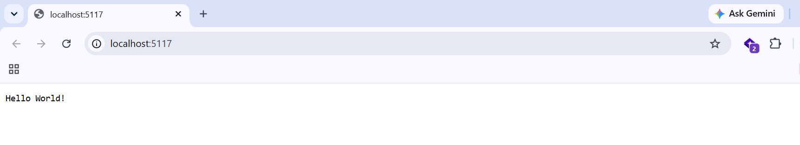
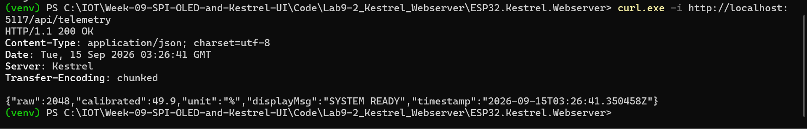
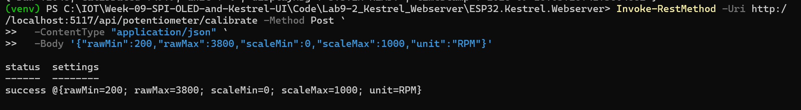
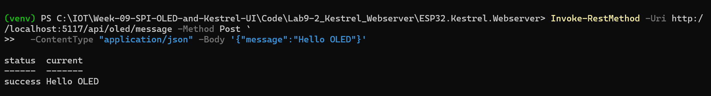
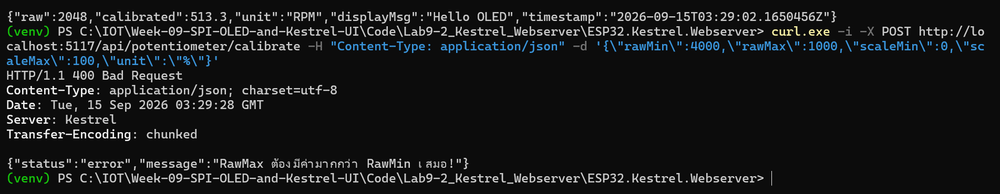
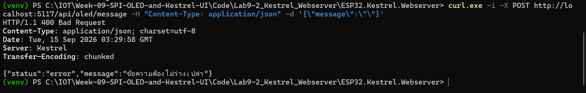
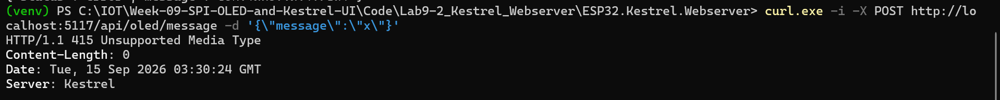
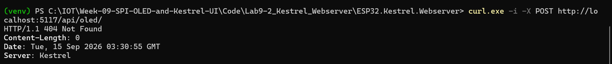

# คำตอบใบงานที่ 9.2
### เอนจินปรับเทียบเซนเซอร์ และ API ควบคุมจอ OLED บน Kestrel Web Server

| | |
| :--- | :--- |
| รหัสนักศึกษา | 67030098 |
| ใบงาน | [07-Labsheet-09-2-Kestrel-Calibration-and-Display-API.md](../07-Labsheet-09-2-Kestrel-Calibration-and-Display-API.md) |
| โค้ด | [`Code/Lab9-2_Kestrel_Webserver/`](../Code/Lab9-2_Kestrel_Webserver/) |
| เฟรมเวิร์ก | .NET 10 Minimal API พอร์ต `5117` |
| สถานะ | build ผ่าน 0 error รันจริงและทดสอบครบทุก endpoint พร้อมภาพหน้าจอ |

---

## API ที่สร้าง

```
GET  /api/telemetry                : ดูค่า Raw ADC, ค่าที่ปรับเทียบแล้ว, ข้อความปัจจุบัน
POST /api/potentiometer/calibrate  : ตั้งค่าปรับเทียบ zero/span
POST /api/oled/message             : ส่งข้อความไปแสดงบนจอ OLED
```

---

## Calibration Service

สูตร Two-Point Linear Calibration:

$$V_{out} = \frac{\text{clamp}(ADC_{raw}) - ADC_{min}}{ADC_{max} - ADC_{min}} \times (Scale_{max} - Scale_{min}) + Scale_{min}$$

ใส่กันชน 2 จุดไว้:
- ถ้า `RawMax <= RawMin` จะ throw error ทันที กันตัวหารเป็นศูนย์หรือติดลบ
- ใช้ `Math.Clamp` บีบค่า ADC ให้อยู่ในช่วงที่กำหนดก่อนคำนวณ กันผลลัพธ์ทะลุ 0-100%

สิ่งที่เพิ่มเข้าไปเอง (ใบงานไม่ได้บอก): `CalibrationService` เป็น Singleton ถูกเรียกพร้อมกันจากหลาย request ได้ เลยใส่ `lock` กันตอนอ่าน/เขียนค่าไว้ด้วย และถ้า `Unit` ที่ส่งมาว่างเปล่าจะ fallback เป็น `"%"` แทนที่จะปล่อยว่างซึ่งทำให้หน้าเว็บแสดงผลแปลกๆ

## การผูก Route

จุดที่น่าสนใจคือ Minimal API ผูก JSON Body กับ Complex Type ให้อัตโนมัติ:

```csharp
app.MapPost("/api/potentiometer/calibrate",
    (CalibrationSettings newSettings, CalibrationService cal) => { ... });
```

`CalibrationSettings` ไม่ได้ลงทะเบียนใน DI จึงรู้ว่าต้องมาจาก Body ส่วน `CalibrationService` ลงทะเบียนไว้แล้วจึงฉีดจาก DI แทน และ JSON binding เป็นแบบไม่สนตัวพิมพ์เล็กใหญ่ ดังนั้น `"rawMin"` จาก JSON จับคู่กับ property `RawMin` ได้พอดี

---

## ผลทดสอบจริง

### ก่อนเริ่ม — เช็คว่าเซิร์ฟเวอร์ขึ้นจริง



เปิด `http://localhost:5117/` เห็น `Hello World!` แปลว่าเซิร์ฟเวอร์รันแล้วพร้อมทดสอบ API

### GET /api/telemetry

```powershell
curl.exe -i -X GET http://localhost:5117/api/telemetry
```



```http
HTTP/1.1 200 OK
Content-Type: application/json; charset=utf-8
Server: Kestrel
Transfer-Encoding: chunked

{"raw":2048,"calibrated":49.9,"unit":"%","displayMsg":"SYSTEM READY","timestamp":"2026-09-15T03:26:41.350458Z"}
```

สังเกตว่าค่า `calibrated` ที่ได้คือ 49.9 ไม่ใช่ 50.0 ตามตัวอย่างในใบงาน — ไม่ใช่บั๊ก เป็นเพราะค่า default ของ `RawMin`/`RawMax` (150 กับ 3950) ไม่สมมาตรกัน จุดกึ่งกลางจริงของช่วงนี้คือ ADC = 2050 ไม่ใช่ 2048 พอคำนวณตามสูตรจริงๆ

$$\frac{2048 - 150}{3950 - 150} \times 100 \approx 49.9$$

### POST /api/potentiometer/calibrate

```powershell
Invoke-RestMethod -Uri http://localhost:5117/api/potentiometer/calibrate -Method Post `
  -ContentType "application/json" `
  -Body '{"rawMin":200,"rawMax":3800,"scaleMin":0,"scaleMax":1000,"unit":"RPM"}'
```



```
status  settings
------  --------
success @{rawMin=200; rawMax=3800; scaleMin=0; scaleMax=1000; unit=RPM}
```

ใช้ `Invoke-RestMethod` แทน `curl.exe -d` เพราะ PowerShell รับสตริงที่มี `{ }` และ `"` ได้ตรงๆ โดยไม่ผ่านการตัด argument แบบโปรแกรมภายนอก จึงไม่มีปัญหาเรื่อง escape ตัวอักษร

### POST /api/oled/message

```powershell
Invoke-RestMethod -Uri http://localhost:5117/api/oled/message -Method Post `
  -ContentType "application/json" -Body '{"message":"Hello OLED"}'
```



```
status  current
------  -------
success Hello OLED
```

เช็คผลข้างเคียงด้วยการเรียก telemetry ซ้ำ:



```json
{"raw":2048,"calibrated":513.3,"unit":"RPM","displayMsg":"Hello OLED","timestamp":"2026-09-15T03:29:02.1650456Z"}
```

หน่วยเปลี่ยนเป็น RPM ค่าคำนวณใหม่ตามสเกลที่ตั้งไว้ และข้อความ OLED อัปเดตถูกต้อง — แปลว่า state ที่เก็บใน `CalibrationService` ยังอยู่ข้าม request จริง (เพราะเป็น Singleton)

ตรวจเลข: $\frac{2048-200}{3800-200} \times 1000 \approx 513.3$ ตรงกับที่ได้ ✅

> **บั๊กที่เจอตอนพัฒนา:** ตอนแรกลองยิงด้วย `curl.exe -d '{"message":"Hello OLED"}'` บน PowerShell แล้วได้ 400 พร้อม error ว่า JSON ขาดกลางคัน สาเหตุคือ PowerShell ตัดคำสั่งที่ช่องว่างในคำว่า "Hello OLED" ทำให้ `curl.exe` ได้รับ Body ไม่ครบ ไม่ใช่บั๊กของเซิร์ฟเวอร์ แก้โดยเปลี่ยนไปใช้ `Invoke-RestMethod` แทนตามภาพด้านบน

### ทดสอบส่งข้อมูลผิดๆ (Fault Injection)

| # | ทดสอบ | คาดว่าได้ | ผลจริง |
| :---: | :--- | :---: | :--- |
| 1 | `rawMin: 4000, rawMax: 1000` | 400 | 400 ✅ |
| 2 | ข้อความว่าง | 400 | 400 ✅ |
| 3 | POST ไม่ใส่ Content-Type | 415 | 415 ✅ |
| 4 | URL ผิด | 404 | 404 ✅ |

**Case 1:**
```http
HTTP/1.1 400 Bad Request
{"status":"error","message":"RawMax ต้องมีค่ามากกว่า RawMin เสมอ!"}
```

**Case 2:**



```http
HTTP/1.1 400 Bad Request
{"status":"error","message":"ข้อความต้องไม่ว่างเปล่า"}
```

**Case 3:**



```http
HTTP/1.1 415 Unsupported Media Type
```

**Case 4:**



```http
HTTP/1.1 404 Not Found
```

ที่สำคัญคือหลังยิง fault ทั้ง 4 แบบ เซิร์ฟเวอร์ยังทำงานปกติ ไม่ล่ม เพราะ `ArgumentException` ถูกดักด้วย try-catch ในตัว endpoint แล้วแปลงเป็น 400 อย่างสุภาพ ไม่ปล่อยให้หลุดขึ้นไปพัง middleware

---

## ตอบคำถามท้ายบท

**1. ทำไมควรคำนวณสเกลที่ฝั่ง Kestrel แทนที่จะคำนวณบน ESP32?**

หลักๆ มีเหตุผลอยู่ 5 ข้อ:

- **เปลี่ยนค่าปรับเทียบได้ทันทีโดยไม่ต้อง flash ใหม่** — ถ้าฝังค่าไว้ในเฟิร์มแวร์ ทุกครั้งที่ต้อง calibrate ใหม่ต้อง compile+flash ทั้งบอร์ด แต่ถ้าคำนวณบนเซิร์ฟเวอร์ แค่ยิง API ก็เปลี่ยนได้เลยขณะระบบยังทำงานอยู่
- **เก็บค่าดิบไว้เป็นหลักฐาน** — ESP32 ส่งค่า ADC ดิบที่ยังไม่ผ่านการตีความ ถ้าพบว่าตั้งค่าปรับเทียบผิดทีหลัง ยังย้อนกลับไปคำนวณใหม่จากข้อมูลเก่าได้ ถ้า ESP32 แปลงเป็นเปอร์เซ็นต์มาให้เลย ข้อมูลดิบจะหายไปเลย
- **ประหยัดทรัพยากร ESP32** — ตัวไมโครคอนโทรลเลอร์ต้องทำงานหลายอย่างพร้อมกันอยู่แล้ว (อ่าน ADC, ยิง SPI, จัดการ Wi-Fi) เลขทศนิยมคำนวณบนชิปที่ไม่มี FPU แรงๆ เป็นภาระที่ไม่จำเป็น
- **มี Source of Truth เดียว** — ถ้ามี ESP32 หลายตัว ตรรกะแปลงค่าจะอยู่ที่เดียวบนเซิร์ฟเวอร์ ทุกตัวใช้มาตรฐานเดียวกันแน่นอน
- **แยกหน้าที่กันชัดเจน** — ESP32 มีหน้าที่วัดและรายงาน ส่วน Kestrel มีหน้าที่ตีความ ถ้า business logic เปลี่ยน (เช่นเปลี่ยนหน่วยจาก % เป็น RPM) ฝั่งฮาร์ดแวร์ไม่ต้องแก้อะไรเลย

**2. ถ้าไม่เช็ค `RawMax <= RawMin` จะเกิด Exception อะไรใน C#?**

คนส่วนใหญ่มักตอบว่า `DivideByZeroException` แต่คำตอบนี้ผิด — ที่จริงแล้ว **ไม่เกิด Exception เลย** ซึ่งอันตรายกว่ามาก

เหตุผลคือ C# แยกกฎการหารตามชนิดข้อมูล: `int / 0` จะ throw แต่ `double / 0` จะไม่ throw กลับได้เป็น `Infinity` หรือ `NaN` แทนตามมาตรฐาน IEEE 754 ในโค้ดนี้ตัวเลขถูกแคสต์เป็น `double` ไว้แล้ว การหารจึงเป็นแบบทศนิยม

ถ้า `RawMax == RawMin` พอดี (เช่น 2000 ทั้งคู่) `Math.Clamp` จะบังคับให้ค่าที่คำนวณเป็น `0/0 = NaN` โดยไม่มีการแจ้งเตือนใดๆ — ทดลองจริงบน .NET 10 ยืนยันแบบนี้:

```
clamped=2000  value=NaN  IsNaN=True
serialize THREW: ArgumentException: .NET number values such as positive and
negative infinity cannot be written as valid JSON.
```

ปัญหาคือ `NaN` จะไหลต่อไปเรื่อยๆ แบบเงียบๆ จนไปพังตอน serialize เป็น JSON (เพราะ JSON ไม่รองรับ NaN/Infinity) กลายเป็น 500 error ที่หาสาเหตุยาก เพราะจุดที่เกิดปัญหาจริง (การหาร) กับจุดที่ error โผล่ (serialize) อยู่คนละที่กัน — บทเรียนคือควรเช็ค input ตั้งแต่ต้นทาง (Fail Fast) ดีกว่าปล่อยให้ค่าเสียหายไหลลึกเข้าไปในระบบ

(ส่วน `RawMax < RawMin` เช่น 4000 กับ 1000 จริงๆ แล้ว `Math.Clamp` จะ throw `ArgumentException` เองเพราะ .NET เช็คว่า min>max ให้อยู่แล้ว แต่ error message จะไม่ตรงประเด็นนักเพราะพูดถึง Clamp ไม่ได้พูดถึงการตั้งค่าปรับเทียบ)

**3. ทำไม POST ที่ไม่มี `Content-Type: application/json` ถึงถูกปฏิเสธด้วย 415?**

เพราะเซิร์ฟเวอร์ไม่เดารูปแบบข้อมูลเอง — Body ของ HTTP Request เป็นแค่ไบต์ดิบๆ ที่ไม่มีความหมายในตัวเอง อาจเป็น JSON, XML, หรือไฟล์ภาพก็ได้ Header `Content-Type` ทำหน้าที่บอกว่า Body นี้คือรูปแบบอะไร

พอ Kestrel เจอ endpoint ที่ต้องอ่าน Body เป็น JSON แต่ไม่มี Content-Type บอก ระบบก็เลือก Input Formatter ไม่ถูกเลยตอบ 415 ทันทีโดยยังไม่แตะ Body เลยด้วยซ้ำ

ความต่างระหว่าง 415 กับ 400: 415 คือ "ยังไม่รู้จะอ่านยังไง" ส่วน 400 คือ "อ่านแล้วแต่ข้างในผิดรูปแบบ" — จากการทดสอบข้างต้น Case 3 (ไม่ใส่ Content-Type) ได้ 415 ส่วนตอนที่ใส่ Content-Type ครบแต่ JSON ขาดหาย (บั๊ก PowerShell) ได้ 400 ตรงกับพฤติกรรมที่ควรจะเป็น

การบังคับให้ประกาศ Content-Type ยังช่วยกัน CSRF ระดับหนึ่งด้วย เพราะฟอร์ม HTML ธรรมดาส่งเป็น `application/json` ไม่ได้ เว็บอันตรายจึงหลอกเบราว์เซอร์ยิง JSON API ข้ามโดเมนแบบง่ายๆ ไม่ได้

---

## วิธีรัน

```bash
cd Code/Lab9-2_Kestrel_Webserver/ESP32.Kestrel.Webserver
dotnet run
```

เปิด Terminal อีกหน้าต่างมาทดสอบ:

```powershell
curl.exe -i http://localhost:5117/api/telemetry

Invoke-RestMethod -Uri http://localhost:5117/api/potentiometer/calibrate -Method Post `
  -ContentType "application/json" `
  -Body '{"rawMin":200,"rawMax":3800,"scaleMin":0,"scaleMax":1000,"unit":"RPM"}'

Invoke-RestMethod -Uri http://localhost:5117/api/oled/message -Method Post `
  -ContentType "application/json" -Body '{"message":"Hello OLED"}'
```

> ถ้า JSON มีช่องว่างในข้อความ ใช้ `Invoke-RestMethod` แทน `curl.exe -d` เสมอ — บน PowerShell `curl.exe -d` กับ single-quote จะโดนตัดที่ช่องว่าง
