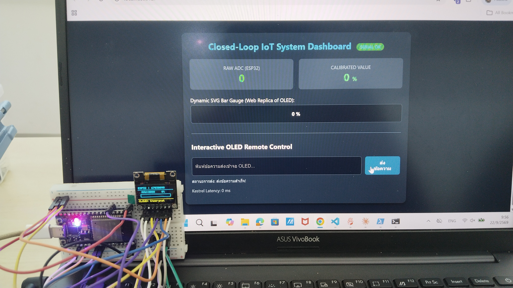
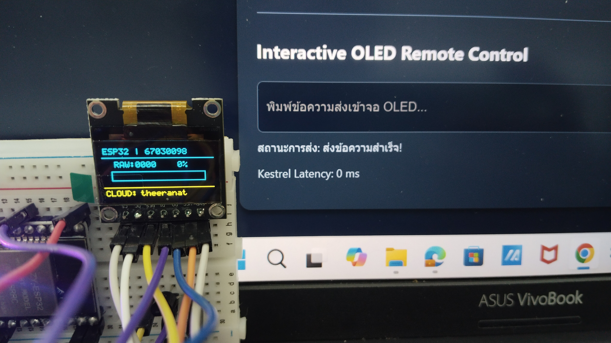
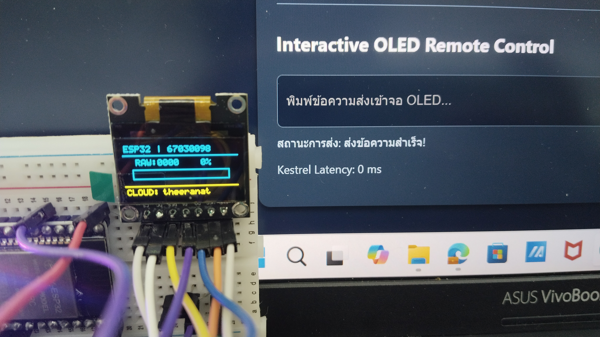

# คำตอบใบงานที่ 9.3
### รวมทุกอย่างเป็นระบบ IoT วงปิด พร้อมกลไกสลับ Edge/Cloud อัตโนมัติ

| | |
| :--- | :--- |
| รหัสนักศึกษา | 67030098 |
| ใบงาน | [08-Labsheet-09-3-End-to-End-IoT-Loop-and-Verification.md](../08-Labsheet-09-3-End-to-End-IoT-Loop-and-Verification.md) |
| โค้ดเฟิร์มแวร์ | [`Code/Lab9-3_ClosedLoop/firmware/Lab9-3-ESP32-ClosedLoop/`](../Code/Lab9-3_ClosedLoop/firmware/Lab9-3-ESP32-ClosedLoop/) |
| โค้ดเซิร์ฟเวอร์ | [`Code/Lab9-3_ClosedLoop/server/ESP32.Kestrel.ClosedLoop/`](../Code/Lab9-3_ClosedLoop/server/ESP32.Kestrel.ClosedLoop/) |
| เฟรมเวิร์ก | ESP-IDF v6.x + .NET 10 Minimal API พอร์ต `5127` |

**สถานะตอนนี้:** เซิร์ฟเวอร์ build ผ่านและทดสอบครบ, เฟิร์มแวร์คอมไพล์+แฟลชลงบอร์ดจริงสำเร็จแล้ว, Checkpoint 3.2 (Edge → Cloud) ยืนยันด้วยรูปถ่ายจริงแล้ว แต่ Potentiometer ยังอ่านค่าไม่ได้ (RAW ค้างที่ 0) ยังไม่ได้แก้ — ดูรายละเอียดหัวข้อ 4

รูปหลักฐาน: [10](../Image/10-lab9-3-cloud-mode-closeup-1.jpg) · [11](../Image/11-lab9-3-cloud-mode-dashboard-full.jpg) · [12](../Image/12-lab9-3-cloud-mode-closeup-2.jpg)

---

## ภาพรวมระบบ

```
Potentiometer --(0-3.3V)--> ESP32 ADC1 (GPIO34)
                                    │
                 "ADC:<raw>,<uptime_ms>\n"  ทุก 50ms (20 Hz)
                                    ▼
                        Kestrel (SerialBridgeService)
                                    │ คำนวณผ่าน CalibrationService
                                    ▼
                 "SET:<percent>:<message>\n"
                                    │
                                    ▼
                  ESP32 วาดจอ Multi-Zone  +  Web Dashboard
```

จุดที่น่าสนใจคือกลไก **Hybrid Edge-Cloud Fallback**: ESP32 จำเวลาล่าสุดที่ได้รับข้อความ `SET:` จาก Kestrel ไว้ ถ้าเงียบเกิน 1.5 วินาที จะสลับไปคำนวณเปอร์เซ็นต์เองแบบง่ายๆ (`raw*100/4095`) และขึ้นข้อความ `EDGE: LOCAL EDGE` แทน — ทำให้ระบบยังใช้งานได้แม้ Kestrel ดับหรือสาย USB หลุด

---

## โครงสร้างโปรเจกต์

```
Code/Lab9-3_ClosedLoop/
├── firmware/Lab9-3-ESP32-ClosedLoop/     ← เฟิร์มแวร์ ESP-IDF
│   └── main/main.c
└── server/ESP32.Kestrel.ClosedLoop/      ← ต่อยอดจาก Lab 9.2
    ├── Program.cs
    ├── Services/
    │   ├── CalibrationService.cs
    │   ├── DisplayMessageRequest.cs
    │   └── SerialBridgeService.cs        ← ตัวเชื่อม Serial สองทิศทาง
    ├── appsettings.json                  ← ตั้งพอร์ต COM ที่นี่
    └── wwwroot/index.html
```

แยกโฟลเดอร์เซิร์ฟเวอร์เป็นคนละโปรเจกต์กับ Lab 9.2 (คนละพอร์ตด้วย 5117 vs 5127) จะได้รันคู่กันได้โดยไม่ชนกัน

---

## บั๊กที่เจอระหว่างทำ

ตอนประกอบโค้ดตามใบงานเพื่อให้รันได้จริง เจอปัญหาอยู่ 3 จุด

### 1. ชื่อไฟล์ใน CMakeLists ไม่ตรงกับโปรเจกต์

ใบงานเขียน `SRCS "Lab9-3-ESP32-ClosedLoop.c"` แต่โครงสร้างโปรเจกต์ที่กำหนดไว้ใช้ชื่อไฟล์ `main.c` ถ้าใช้ตามใบงานตรงๆ `idf.py build` จะ error หาไฟล์ไม่เจอทันที แก้โดยเปลี่ยน `SRCS` ให้ตรงกับชื่อไฟล์จริง:

```cmake
idf_component_register(SRCS "main.c"
                    INCLUDE_DIRS "."
                    REQUIRES driver esp_driver_spi esp_driver_gpio esp_driver_uart esp_adc esp_timer
)
```

### 2. CalibrationService ไม่กันการเข้าถึงพร้อมกัน

`CalibrationService` เป็น Singleton ที่ถูกแตะจาก 2 ที่พร้อมกันตลอดเวลา คือ HTTP request (ตอนเรียก `/api/potentiometer/calibrate` หรือ `/api/oled/message`) กับ `SerialBridgeService` ที่วนอ่านข้อมูลจากบอร์ดสูงสุด 20 ครั้งต่อวินาที แต่โค้ดต้นฉบับไม่ได้กันตรงนี้ไว้เลย ถ้าสองฝั่งเข้าถึงพร้อมกันพอดีมีโอกาสเกิด race condition ได้ (แม้จะน้อย) เลยเพิ่ม `lock` ครอบทุกจุดที่อ่าน/เขียนค่าร่วมกัน ไม่กระทบพฤติกรรมของ API เลย แค่กันไว้ให้ปลอดภัยขึ้น

### 3. Serial Port ปิดช้าตอน Shutdown (เจอตอนทดสอบกับบอร์ดจริง)

ตอนทดสอบจริง เจอเคสที่กด Ctrl+C ปิด Kestrel แล้วรันใหม่ทันที เจอ error `Access to the path 'COM3' is denied` สาเหตุคือโค้ดใช้ `ReadLine()` แบบ blocking ที่รอได้นานสุด 2 วินาที พอกด Ctrl+C ตัวโปรแกรมต้องรอให้ `ReadLine()` คืนค่าก่อนถึงจะปิดได้จริง ถ้ารันใหม่เร็วเกินไปก่อน process เก่าคืนพอร์ต ก็เลยชนกัน

แก้โดยลงทะเบียนให้บังคับปิดพอร์ตทันทีตอนกด Ctrl+C แทนที่จะรอให้ `ReadLine()` ปลดบล็อกเอง:

```csharp
using var cancelRegistration = stoppingToken.Register(() =>
{
    try { _serialPort?.Close(); } catch { }
});
```

> ระหว่างไล่ปัญหานี้ พบว่าสาเหตุหลักจริงๆ ไม่ใช่บั๊กนี้อย่างเดียว แต่เกิดจากการรัน `idf.py flash monitor` หลายรอบแล้วไม่เคยกด `Ctrl+]` ออกจริงๆ เลยมี `idf_monitor.py` ค้างอยู่เบื้องหลังพร้อมกันถึง 6 process ถือพอร์ตไว้ (เช็คได้ด้วย `Get-CimInstance Win32_Process -Filter "Name='python.exe'"`) — ใบงานเตือนเรื่องนี้ไว้แล้วจริงๆ ในหัวข้อ 5 ต้องกด Ctrl+] ออกจาก monitor ให้เรียบร้อยทุกครั้งก่อนสลับไปรัน Kestrel

---

## ผลทดสอบจริง

### ฝั่งเซิร์ฟเวอร์

```bash
cd Code/Lab9-3_ClosedLoop/server/ESP32.Kestrel.ClosedLoop
dotnet build     # ผ่าน 0 error
dotnet run       # Now listening on: http://localhost:5127
```

Log ตอนสตาร์ท (ตอนนั้นยังไม่มี ESP32 ต่ออยู่):

```
info: SerialBridgeService: กำลังเปิดการเชื่อมต่อ Serial Port: COM3 ที่ BaudRate 115200
info: Now listening on: http://localhost:5127
info: SerialBridgeService: เชื่อมต่อพอร์ต COM3 สำเร็จ!
```

ทดสอบ API ทั้ง 3 เส้นทางผ่าน curl:

| # | ทดสอบ | ผล |
| :---: | :--- | :--- |
| 1 | `GET /api/telemetry` | ได้ `raw:0, isConnected:true` ปกติ |
| 2 | `POST /api/potentiometer/calibrate` | success, ตั้งหน่วยเป็น RPM ได้ |
| 3 | `POST /api/oled/message` | success |
| 4 | `GET /api/telemetry` ซ้ำ | เห็นค่าที่ตั้งไว้ยังอยู่ ยืนยันว่า state ไม่หาย |
| 5 | ทดสอบ rawMin > rawMax | ได้ 400 ตามคาด |
| 6 | ทดสอบข้อความว่าง | ได้ 400 ตามคาด |
| 7 | เปิดหน้าเว็บ | 200 OK เสิร์ฟ index.html ได้ |

ที่ `raw` ยังเป็น 0 ตอนนั้นเพราะไม่มี ESP32 ต่ออยู่จริง แต่พอร์ต COM3 เปิดได้ (`isConnected: true` แค่บอกว่าพอร์ตเปิดสำเร็จ ไม่ได้แปลว่ามีบอร์ดตอบกลับ) ไม่มี error หรือโปรแกรมล่มแม้ไม่มีข้อมูลไหลเข้ามาเลย

ทดสอบผ่านเว็บจริงด้วย พิมพ์ข้อความในช่อง Remote Control กดส่ง — badge ขึ้น `SERIAL OK` และข้อความ "ส่งข้อความสำเร็จ!" ปรากฏถูกต้อง ทดสอบยิงทั้งกรณีสำเร็จและกรณี error สลับกันไปมาหลายรอบ ปิดเปิดเซิร์ฟเวอร์ด้วย Ctrl+C — ไม่มี exception หลุดออกมาเลย

สิ่งที่เพิ่มเข้าไปเอง: ใส่ badge `SERIAL OK`/`NO SERIAL` กับตัวเลข latency บนหน้าเว็บ (ใบงานไม่มี) เพื่อให้เห็นสถานะการเชื่อมต่อได้ง่ายโดยไม่ต้องเปิด DevTools

### ฝั่งเฟิร์มแวร์

นำโค้ดไป `idf.py build` แล้ว flash ลงบอร์ดจริงผ่าน ESP-IDF v6.1 — build ผ่านตั้งแต่ครั้งแรกหลังแก้บั๊กชื่อไฟล์ ไม่เจอปัญหาอื่นเพิ่ม

Serial Monitor ยืนยันว่าเฟิร์มแวร์รันถูกต้อง:

```
ADC:0,22740
ADC:0,22790
ADC:0,22840
```

ตัวเลข uptime เพิ่มขึ้นครั้งละ 50ms พอดีทุกบรรทัด ตรงกับที่ตั้ง `vTaskDelay` ไว้ในโค้ด (20 Hz)

### Checkpoint 3.2 — Edge เปลี่ยนเป็น Cloud

หลังแก้ปัญหา COM Port ค้างแล้ว รัน Kestrel เชื่อมต่อบอร์ดสำเร็จ ทดสอบพิมพ์ข้อความจากเว็บส่งไปที่จอ OLED จริง:







จากรูปยืนยันได้ว่า:
- จอโซน 1 แสดง `ESP32 | 67030098` ถูกต้อง
- จอโซน 3 เปลี่ยนจาก `EDGE:` เป็น `CLOUD: theeranat` ทันที — แปลว่า ESP32 ได้รับข้อความ `SET:0:theeranat` จาก Kestrel จริง
- หน้าเว็บขึ้น badge `SERIAL OK` และ "ส่งข้อความสำเร็จ!"
- ข้อความบนจอตรงกับที่พิมพ์บนเว็บเป๊ะ

ส่วนนี้คือหลักฐานที่หนักแน่นที่สุดในรายงาน เพราะพิสูจน์ว่าทั้งวง (ESP32 → Serial → Kestrel → Serial → ESP32 → OLED) ทำงานครบจริง

### ปัญหาที่ยังไม่ได้แก้ — Potentiometer อ่านค่าไม่ได้

จากรูปทั้ง 3 ข้างบน จะเห็นว่า `RAW:0000` และแถบ Gauge ว่างเปล่าตลอด แม้ระบบ Edge-Cloud จะทำงานถูกต้องแล้ว

คาดว่าเป็นปัญหาการต่อสาย Potentiometer โดยเฉพาะขา Wiper (ขากลาง) ที่ต้องต่อเข้า GPIO 34 ให้ถูก เพราะฝั่งโค้ดอ่านค่าไม่มี error ใดๆ เลย (ยืนยันว่าซอฟต์แวร์ถูกต้อง ปัญหาอยู่ที่วงจรไฟฟ้า) สิ่งที่ต้องทำต่อ:

1. เช็คว่าขา Wiper ต่อเข้า GPIO 34 จริง (ดูตำแหน่งจริงบนตัวโพเทนชิโอมิเตอร์ ไม่ใช่ดูจากเลขที่พิมพ์)
2. วัดแรงดันด้วยมัลติมิเตอร์ที่ขา Wiper ขณะหมุน ต้องเห็นค่าเปลี่ยนระหว่าง 0-3.3V
3. ถ้าแรงดันเปลี่ยนแต่ `RAW` ในโปรแกรมยังไม่ขยับ ให้เช็คว่า `ADC_CHANNEL_6` ตรงกับ GPIO 34 จริงหรือไม่

---

## Checklist การทดสอบ

**Checkpoint 3.1 (Edge Mode ก่อนเปิด Kestrel)**
- [x] Serial Monitor เห็น `ADC:xxxx,xxxxx` ไหลต่อเนื่อง
- [x] จอโซน 1 แสดง `ESP32 | 67030098`
- [ ] หมุน Potentiometer แล้วค่า RAW ขยับ — ยังไม่ผ่าน
- [x] โซน 3 แสดง `EDGE: LOCAL EDGE`
- [x] กด Ctrl+] ออกจาก monitor ก่อนเปิด Kestrel

**Checkpoint 3.2 (เปลี่ยนเป็น Cloud Mode)**
- [x] ตั้งพอร์ต COM ใน appsettings.json ถูกต้อง
- [x] `dotnet run` เชื่อมต่อสำเร็จ
- [x] จอเปลี่ยนจาก EDGE เป็น CLOUD ทันที (มีรูปยืนยัน)
- [ ] ปิด Kestrel แล้วจอดีดกลับเป็น EDGE ภายใน 1.5 วิ — ยังไม่ได้ถ่ายรูปยืนยัน
- [ ] เปิด Kestrel ใหม่แล้วจอกลับเป็น CLOUD เอง — ยังไม่ได้ถ่ายรูปยืนยัน

**ตาราง Co-Verification (หมุน Potentiometer 5 ตำแหน่งแล้วเทียบค่า):**

ยังกรอกไม่ได้เพราะ Potentiometer ยังอ่านค่าไม่ได้ ต้องแก้การต่อสายก่อน แล้วค่อยกรอกด้วยค่าจริงจากฮาร์ดแวร์เท่านั้น จำลองแทนไม่ได้

---

## วิธี Build และรัน

**เฟิร์มแวร์** (ต้องมี ESP-IDF v6.x หรือ Docker):
```powershell
cd Code/Lab9-3_ClosedLoop/firmware/Lab9-3-ESP32-ClosedLoop
idf.py build
idf.py -p COM3 flash monitor
```
กด `Ctrl+]` ออกจาก monitor ก่อนเปิด Kestrel เสมอ ไม่งั้นจะชน `Access is denied`

**เซิร์ฟเวอร์** (ทดสอบได้ทันทีแม้ไม่มีบอร์ด):
```bash
cd Code/Lab9-3_ClosedLoop/server/ESP32.Kestrel.ClosedLoop
```
แก้ `appsettings.json` ให้ตรงกับพอร์ตบอร์ดจริงก่อน แล้วรัน `dotnet run` เปิด `http://localhost:5127/`

---

## ตอบคำถามท้ายบท

**1. ถ้าความหน่วงรวมเกิน 200ms คอขวดน่าจะอยู่ตรงไหน?**

คำตอบคือ **Serial UART (115200 bps)** ไม่ใช่ SPI หรือ ADC ลองคำนวณเทียบกันดู:

- ADC1 อ่านค่าจากรีจิสเตอร์ในชิปโดยตรง ใช้เวลาน้อยกว่า 0.1 ms
- SPI ที่ 10 MHz ส่ง Framebuffer เต็ม 1024 ไบต์ ใช้เวลาประมาณ 0.82 ms
- UART ที่ 115200 bps ส่งข้อความสั้นๆ อย่าง `"ADC:2048,123456\n"` (ประมาณ 17 ไบต์) ใช้เวลาประมาณ 1.18 ms **ต่อทิศทางเดียว**

UART ช้ากว่า SPI ประมาณ 86 เท่าทั้งที่ส่งข้อมูลน้อยกว่ามาก เพราะความถี่สัญญาณนาฬิกาต่ำกว่ามาก แถมยังต้องส่งสองทิศทาง (ขาขึ้น+ขาลง) ผ่านสาย USB เส้นเดียวกัน ถ้า `ReadLine()` ฝั่ง .NET รอไม่เจอ `\n` (เช่นสัญญาณรบกวนทำให้ไบต์เพี้ยน) จะรอจน timeout เต็ม 2 วินาที กระทบทั้งระบบทันที

ถ้าเจอ latency สูงเกิน 200ms ให้ตรวจ UART ก่อนเป็นอันดับแรก วิธีแก้คือเพิ่ม baud rate หรือลดขนาด/ความถี่ของข้อความที่ส่ง

**2. ทำไมต้องมี Hybrid Edge-Cloud Fallback?**

ระบบที่พึ่งพา Cloud 100% มีจุดอ่อนคือถ้าเชื่อมต่อขาดหาย อุปกรณ์จะค้างอยู่กับคำสั่งสุดท้ายที่เคยได้รับ ซึ่งอันตรายมากในงานควบคุมจริง เช่นแขนกลอุตสาหกรรมที่ค้างตำแหน่งเดิมทั้งที่สถานการณ์เปลี่ยนไปแล้ว หรือระบบระบายความร้อนที่พัดลมค้างความเร็วเดิมทั้งที่อุณหภูมิเปลี่ยนไปมาก

กลไกที่ทำในแล็บนี้คือให้ ESP32 จับเวลาเองว่าได้รับคำสั่งจาก Kestrel ครั้งล่าสุดเมื่อไหร่ ถ้าเงียบเกิน 1.5 วินาที ให้กลับมาคำนวณเองแบบง่ายๆ ทันที แทนที่จะค้างเฉยๆ

ข้อดีคืออุปกรณ์ยังตอบสนองโลกจริงได้เสมอแม้ Cloud ล่ม (แค่ความแม่นยำลดลง ไม่ใช่หยุดทำงาน) ระบบเสื่อมประสิทธิภาพแบบค่อยเป็นค่อยไปแทนที่จะพังทันที และพอ Kestrel กลับมาออนไลน์ ระบบก็ยกระดับกลับเป็น Cloud Mode เองโดยไม่ต้องรีเซ็ตอะไร (พิสูจน์แล้วใน Checkpoint 3.2 ข้างบน) ถ้าไม่มีกลไกนี้ Cloud จะกลายเป็นจุดล้มเหลวจุดเดียวที่ทำให้อุปกรณ์ทั้งหมดหยุดทำงานพร้อมกันได้

**3. ทำไมห้ามใช้ ADC2 ตอนเปิด Wi-Fi?**

ESP32 มี ADC อยู่ 2 ชุดแยกกัน คือ ADC1 (GPIO 32-39) กับ ADC2 (GPIO 0,2,4,12-15,25-27) ปัญหาคือโมดูล Wi-Fi/Bluetooth ของชิปต้องใช้วงจร ADC ตัวเดียวกับ ADC2 ในการวัดกำลังสัญญาณวิทยุและปรับจูนความถี่ตลอดเวลาที่รับส่งแพ็กเก็ต เป็นข้อจำกัดที่ฝังอยู่ในสถาปัตยกรรมชิปเลย ไม่ใช่บั๊กที่แก้ด้วย driver ได้

พอโปรแกรมกับ Wi-Fi พยายามใช้ ADC2 พร้อมกัน จะเกิดการแย่งทรัพยากรกัน ทำให้ค่าที่อ่านได้เพี้ยนไม่สัมพันธ์กับแรงดันจริง หรือแย่กว่านั้นคือโปรแกรมค้างรอ mutex ที่ Wi-Fi driver ถือครองอยู่

ทางแก้คือต่อเซนเซอร์แอนะล็อกเข้า ADC1 เท่านั้น (แล็บนี้ใช้ GPIO 34) เพราะ ADC1 ไม่เกี่ยวข้องกับวงจร RF เลย จึงอ่านค่าได้เสถียรแม้ตอน Wi-Fi กำลังทำงานอยู่พร้อมกัน
